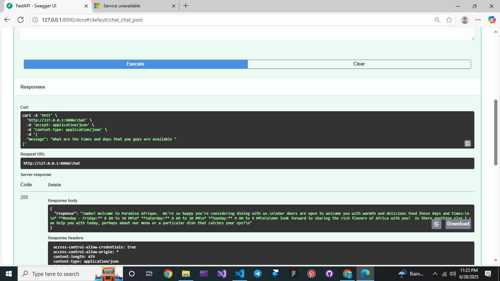
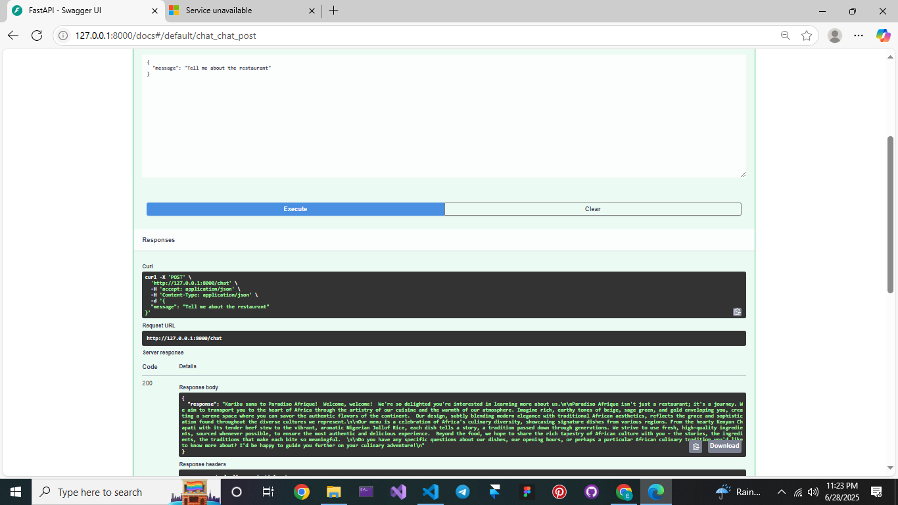

# 🤖 Paradiso Afrique Restaurant Chatbot

This AI-powered chatbot serves as a virtual chef and assistant for **Paradiso Afrique**, an African-themed restaurant.

### 🧠 How It Works

- Built with **FastAPI** and powered by **Google's Gemini API**.
- When users ask about:
  - **Menu items**, it reads from `menu.json` and returns detailed dish descriptions.
  - **Opening hours**, it reads from `hours.json` and gives accurate daily times.
- The bot responds in a **warm, helpful tone**, acting like a friendly host.
- It supports frontend integration and can be tested via `/docs` or Postman.

### 🗂️ JSON-based Knowledge
- `data/menu.json` → Contains dishes and descriptions.
- `data/hours.json` → Contains business hours for each day.

Ideal for engaging users with **interactive, culturally rich restaurant info**.

